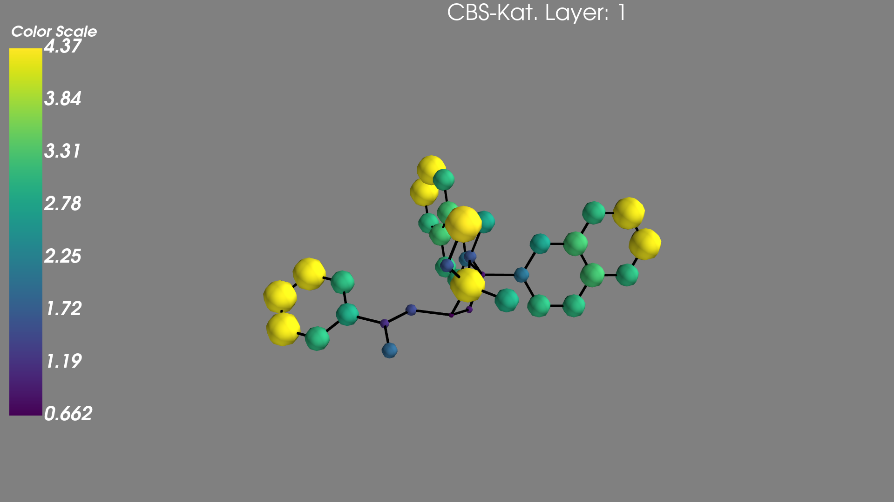
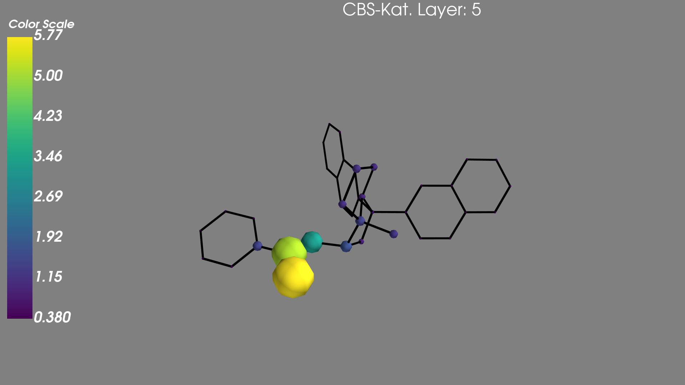

# GNN Node Feature Summation Visualizer

This tool helps visualize the sum of node features in each layer of a GNN-based model. It can work with random or molecular graphs based on SMILES strings.

## How-To:

To test with random graphs, use the `'GNN'` `model_mode.` If you have your own model, import your model class and load your trained model, ensuring that all GNN layers are grouped in `self.convs = torch.nn.ModuleList()`. 

## Example for Corey-Bakshi-Shibata Catalysts:

After the first layer, nearly all nodes have a large node feature sum | while only a few nodes have a large feature sum at the last layer.
:-: | :-:
 | 

### Disclaimer:

The trained CBS model is intentionally not included in the repository and may be added later for academic purposes.
